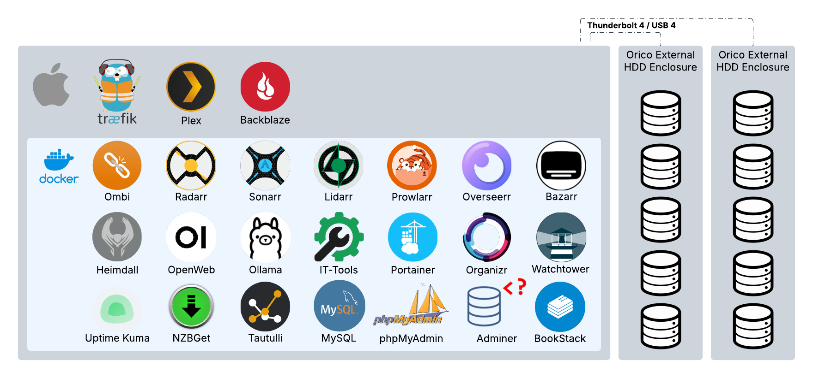
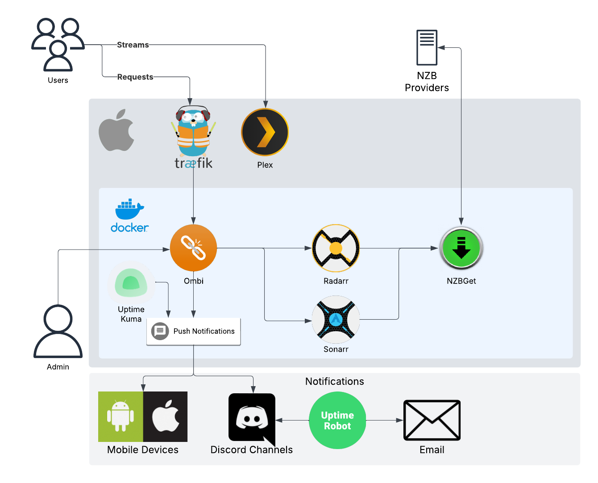

# Mac Plex Server Setup

A complete Docker-based Plex media server setup for macOS with Traefik reverse proxy, SSL certificates, and a comprehensive media management stack.

## Features

- **Traefik Reverse Proxy** with automatic SSL certificates via Let's Encrypt (runs natively on macOS for optimal network performance)
- **Plex Media Server** with supporting applications:
  - Sonarr (TV Shows)
  - Radarr (Movies)
  - Lidarr (Music)
  - Bazarr (Subtitles)
  - Prowlarr (Indexer Management)
  - NZBGet (Downloader)
  - Overseerr (Request Management)
  - Ombi (Alternative Request Management)
  - Tautulli (Plex Analytics)
- **AI Tools** with Ollama and Open WebUI
- **Dashboards** with Heimdall and Organizr
- **Database** with PostgreSQL (Sonarr/Radarr/n8n), MySQL, phpMyAdmin, and Adminer
- **Monitoring** with Beszel (host, container and drive-health metrics), Dozzle (container logs) and Uptime Kuma
- **Utilities** with Portainer and IT-Tools
- **Automated maintenance**: nightly database dumps, container updates, and Docker cleanup (see [Automated Maintenance](#automated-maintenance))

## Prerequisites

- **macOS** (tested on macOS 14+)
- **Domain name** with DNS pointing to your server's public IP
- **Router configuration** with ports 80 and 443 forwarded to your Mac
- **Basic terminal knowledge** (copy/paste commands)

**Note**: Homebrew and Docker Desktop will be installed automatically by the install script.

## Architecture Overview

This setup uses a **hybrid architecture** that's optimized for macOS:

### 🖥️ **Native macOS Components**
- **Traefik** - Runs as a native macOS LaunchAgent (not in Docker)
- **Plex Media Server** - Optional native installation for better performance

### 🐳 **Docker Components**
- **All other services** - Run in Docker containers for easy management

### 🤔 **Why Traefik Runs Natively?**

**Performance & Networking**: macOS Docker networking has limitations that affect reverse proxy performance and IP whitelisting middleware. Running Traefik natively provides:

- **Direct network access** - No Docker network translation overhead
- **Better SSL performance** - Native SSL termination without container networking layers
- **Reliable IP whitelisting** - Middleware can see real client IPs without Docker network masking
- **Port binding efficiency** - Direct access to ports 80/443 without Docker proxy

**Alternative approaches** (like HAProxy on Mac and Traefik in Docker) would require additional complexity and still face similar networking limitations on macOS. But you could then use labels if you so wish. 

## System Architecture Diagrams

### 🖥️ Mac-Docker Applications Stack



This setup includes 20+ integrated applications running in a hybrid macOS/Docker environment:

**🖥️ Native macOS:**
- **Apple macOS** - Host operating system
- **Traefik** - Reverse proxy and SSL termination (native for optimal performance)
- **Plex Media Server** - Core media streaming (can run native or Docker)
- **Backblaze** - Cloud backup solution

**🐳 Docker Containerized Services:**

**Media Management:**
- **Sonarr** - TV show automation and management
- **Radarr** - Movie automation and management  
- **Lidarr** - Music collection management
- **Bazarr** - Subtitle management
- **Prowlarr** - Indexer management and integration

**Download & Processing:**
- **NZBGet** - Usenet downloader
- **Ombi** - Primary request management platform
- **Overseerr** - Modern request management interface (still in beta, I use ombi primarily, but have this in the works)

**AI & Automation:**
- **Ollama** - Local AI language model hosting
- **OpenWeb UI** - Web interface for AI interactions
- **n8n** - Workflow automation (stores data in PostgreSQL)

**Dashboards & Management:**
- **Heimdall** - Primary application dashboard
- **Organizr** - Alternative dashboard solution
- **Portainer** - Docker container management
- **IT-Tools** - Collection of useful web utilities

**Database & Analytics:**
- **MySQL** - Primary database server
- **phpMyAdmin** - Web-based database administration
- **Adminer** - Lightweight database management
- **Tautulli** - Plex usage analytics and monitoring

**System Monitoring:**
- **Uptime Kuma** - Internal service monitoring
- **Beszel** - Mac CPU/memory/disk/network, per-container usage, drive health and alerts
- **Dozzle** - Live log viewer for all containers

### 🔄 Plex Request Engine Flow



#### 🔄 How the Plex Request Engine Works:

**📺 Streaming Flow:**
- Users log into Plex to stream shared media from the server

**📝 Request & Approval Flow:**
1. **Request Submission**: Users log into Ombi to request new media (TV shows/movies)
2. **Admin Review**: Ombi sends request to admin for approval/denial via push notifications
3. **Status Notifications**: Request status sent via Discord and Mobile Push to keep users informed
4. **Processing Branch**: Approved requests automatically sent to Sonarr (TV) and Radarr (Movies)
   - Denied requests stop at Ombi

**⬇️ Download & Processing Flow:**

5. **NZB Discovery**: Sonarr and Radarr find media NZB files from configured providers
6. **Download Management**: NZB files sent to NZBGet for downloading from Usenet
7. **File Processing**: After download completion, Sonarr/Radarr scan NZBGet download directory
8. **Media Organization**: Files are renamed and moved to Plex media directory with proper folder structure
9. **Library Updates**: Plex scans new media at regular intervals and adds to server library

**📱 Completion & Notifications:**

10. **Availability Detection**: Ombi scans Plex library and detects when requested media is available
11. **User Notifications**: Completion notifications sent to Discord channels and user mobile apps
12. **Ready to Stream**: Users can now access their requested content via Plex

**📊 System Monitoring:**
- **Uptime Kuma**: Internal service monitoring for all Docker containers with Discord notifications
- **Uptime Robot**: External monitoring for Ombi accessibility with Discord and Email alerts

**💾 Storage Infrastructure:**
- **Orico External HDD Enclosures** (Thunderbolt 4 / USB 4): High-capacity storage for media library
- **Dual drive setup**: Redundancy and performance optimization for large media collections

## Quick Start (TL;DR)

For experienced users who want the quick version:

```bash
# 1. Clone and configure
git clone https://github.com/mgroff2/mac_plex.git
cd mac_plex
cp docker/.env.example docker/.env
nano docker/.env  # Edit DOMAIN, EMAIL, PATHS, IPs

# 2. Install prerequisites
chmod +x scripts/install.sh && ./scripts/install.sh

# 3. Source environment and start
source docker/.env
launchctl load ~/Library/LaunchAgents/com.traefik.startup.plist
cd docker && docker-compose up -d

# 4. Validate and access
./scripts/validate.sh
open https://heimdall.yourdomain.com
```

## Detailed Installation Guide

Follow these steps carefully to set up your Mac Plex Server:

**⏱️ Total Time**: 15-30 minutes (depending on internet speed)
**💾 Disk Space**: ~2GB for applications, plus your media storage
**🔧 What You'll Get**: 20+ applications running with SSL certificates and dashboard access

### Step 1: Clone the Repository
```bash
git clone <repository-url>
cd mac_plex
```

### Step 2: Configure Your Environment
First, create and customize your environment configuration:

```bash
# Copy the template to create your actual configuration
cp docker/.env.example docker/.env

# Edit the configuration file
nano docker/.env
```

**IMPORTANT**: You must update ALL the following variables in your `.env` file:

#### 🏠 **Directory Settings**
```bash
# Where Docker will store all application data
DATA_DIR=/path/to/your/docker/data
# Where your media files are stored
PLEX_DIR=/path/to/your/plex/media

# Optional: TV library on a separate volume (defaults to ${PLEX_DIR}/TV Shows)
# TV_DIR=/path/to/your/tv/shows

# Optional: override where specific data lives (defaults to DATA_DIR)
# ARR_DATA_DIR=/path/to/your/arr/data        # Radarr/Sonarr config
# DB_DATA_DIR=/path/to/your/database/data    # MySQL/Postgres data
```

#### 👤 **User/Group Settings**
```bash
# Get your user ID and group ID by running: id
PUID=1000  # Replace with your actual user ID
PGID=1000  # Replace with your actual group ID
```

#### 🌐 **Domain Settings**
```bash
# Your domain name (must point to your server's IP)
DOMAIN=example.com
# Your email for Let's Encrypt SSL certificates
LETSENCRYPT_EMAIL=your@email.com
# Cloudflare API token used for the Let's Encrypt DNS challenge (wildcard cert)
# Permissions: Zone:DNS:Edit + Zone:Zone:Read, scoped to your domain's zone only
CF_DNS_API_TOKEN=your_cloudflare_dns_api_token
```

> Your domain's DNS must be hosted on Cloudflare. Traefik uses the token to create a temporary `_acme-challenge` TXT record, so no inbound ports need to be open for certificate issuance or renewal.

#### 🔒 **Security Settings**
```bash
# IP ranges allowed to access your services (comma-separated)
# Include your local networks and any remote IPs you want to allow
IP_ALLOW_LIST=127.0.0.1/32,192.168.1.0/24,10.0.0.0/8
```

#### 🗄️ **Database Settings**
```bash
# Create secure passwords for MySQL
MYSQL_ROOT_PASSWORD=your_secure_password_here
MYSQL_DATABASE=your_database_name
MYSQL_USER=your_database_user
MYSQL_PASSWORD=your_database_password
# Create secure credentials for PostgreSQL (used by Radarr, Sonarr and n8n)
POSTGRES_USER=postgres
POSTGRES_PASSWORD=your_secure_password_here
```

> **Sonarr/Radarr on PostgreSQL**: `.env.example` also lists `SONARR_DB_*` and `RADARR_DB_*`. Docker Compose does **not** read them - copy the values into each app's `config.xml` (`<PostgresUser>`, `<PostgresPassword>`, `<PostgresPort>`, `<PostgresHost>`, `<PostgresMainDb>`, `<PostgresLogDb>`) and create the databases and roles first, because the apps will not. See the [Servarr Postgres guide](https://wiki.servarr.com/en/sonarr/postgres-setup). Leave those settings out and the app simply uses SQLite in its config folder.

> 🔒 **Keep machine-specific values in `.env`.** `docker-compose.yml` is committed to a public repository, so never hardcode absolute paths, usernames, domains, IP addresses or credentials in it. Add a variable to `.env` (and a placeholder to `.env.example`) instead.

#### 🕐 **Timezone Settings**
```bash
# Which running services the nightly update job skips (comma-separated)
AUTO_UPDATE_EXCLUDE=mysql,postgres
# Where nightly database dumps go, and how long to keep them
# DB_BACKUP_DIR=/path/to/your/db-backups   # defaults to $DATA_DIR/db-backups
DB_BACKUP_KEEP_DAYS=14

# Set your timezone (find yours at: https://en.wikipedia.org/wiki/List_of_tz_database_time_zones)
TZ=America/New_York
```

### Step 3: Run the Installation Script
Now that your environment is configured, run the installation script to set up all prerequisites:

```bash
chmod +x scripts/install.sh
./scripts/install.sh
```

The script will:
- Install Homebrew (if not already installed)
- Install Docker Desktop, Plex Media Server, and Traefik
- Create necessary directories and certificates
- Set up the Traefik LaunchAgent for automatic startup
- Backup any existing configuration files

### Step 4: Source Your Environment (Important!)
After saving your `.env` file, source it so the variables are available:

```bash
source docker/.env
```

### Step 5: Start Traefik Reverse Proxy
Traefik will automatically generate SSL certificates and handle routing:

```bash
launchctl load ~/Library/LaunchAgents/com.traefik.startup.plist
```

**Wait 30-60 seconds** for Traefik to start and generate configuration files.

### Step 6: Start All Docker Services
Finally, start all your media server applications:

```bash
cd docker
docker-compose up -d
```

### Step 7: Verify Everything is Running
Check that all services are running:

```bash
# Check Traefik is running
launchctl list | grep traefik

# Check Docker containers are running
docker-compose ps

# Check Traefik logs for any issues
tail -f /tmp/traefik.log
```

### Step 8: Validate Your Installation
Run the validation script to check if everything is working correctly:

```bash
./scripts/validate.sh
```

This script will check:
- Environment configuration
- Required directories and files
- Service status and connectivity
- SSL certificate generation
- Network accessibility

### Step 9: Access Your Services
Your services should now be available at:
- **Traefik Dashboard**: `https://traefik.yourdomain.com`
- **Heimdall Dashboard**: `https://heimdall.yourdomain.com` (recommended starting point)
- **Plex**: `https://plex.yourdomain.com`
- **All other services**: `https://servicename.yourdomain.com`

## First-Time Setup

After installation, you'll need to configure each service:

1. **Start with Heimdall** (`https://heimdall.yourdomain.com`) - This is your dashboard
2. **Configure Plex** (`https://plex.yourdomain.com`) - Set up your media libraries
3. **Set up Sonarr/Radarr** for TV shows and movies
4. **Configure Prowlarr** for indexer management
5. **Set up Overseerr** for media requests

## What's Included

Your Mac Plex Server includes these applications:

### 🎬 **Media Management**
- **Plex Media Server** - Stream your media anywhere
- **Sonarr** - Automatic TV show downloading and management
- **Radarr** - Automatic movie downloading and management
- **Lidarr** - Music collection management
- **Bazarr** - Subtitle management for movies and TV shows

### 🔍 **Download Management**
- **Prowlarr** - Indexer management (finds content)
- **NZBGet** - Usenet downloader
- **Overseerr** - Media request management (users can request content)
- **Ombi** - Alternative media request platform

### 📊 **Monitoring & Analytics**
- **Tautulli** - Plex usage analytics and statistics
- **Beszel** - System, container and drive-health monitoring at `https://beszel.yourdomain.com`
- **Dozzle** - Container log viewer at `https://dozzle.yourdomain.com` (login required; create it in the setup wizard on first visit)
- **Uptime Kuma** - Service uptime monitoring

### 🤖 **AI & Automation**
- **Ollama** - Local AI language models
- **Open WebUI** - Web interface for AI chat
- **n8n** - Workflow automation at `https://n8n.yourdomain.com`

### 🛠️ **Management & Utilities**
- **Heimdall** - Application dashboard (start here!)
- **Organizr** - Alternative dashboard
- **Portainer** - Docker container management
- **IT-Tools** - Collection of useful web tools

### 🗄️ **Database**
- **PostgreSQL** - Database server for Sonarr, Radarr and n8n
- **MySQL** - Database server
- **phpMyAdmin** - Web-based MySQL administration
- **Adminer** - Lightweight database management

### 🔐 **Security & Networking**
- **Traefik** - Reverse proxy with automatic SSL certificates
- **IP Whitelisting** - Restrict access to your specified networks
- **Let's Encrypt** - Free wildcard SSL certificate for all services (Cloudflare DNS challenge)

> 🔒 **Security Notice**: This setup includes comprehensive security measures. Read our [Security Guide](SECURITY.md) for detailed security configuration, best practices, and incident response procedures.

## Usage

### Accessing Services

Once everything is running, you can access your services at:

- **Traefik Dashboard**: `https://traefik.yourdomain.com`
- **Heimdall Dashboard**: `https://heimdall.yourdomain.com`
- **Plex**: `https://plex.yourdomain.com` (or local access)
- **Sonarr**: `https://sonarr.yourdomain.com`
- **Radarr**: `https://radarr.yourdomain.com`
- **Overseerr**: `https://overseerr.yourdomain.com`
- **Portainer**: `https://portainer.yourdomain.com`

### Managing Traefik

- **Restart Traefik:**
  ```bash
  launchctl unload ~/Library/LaunchAgents/com.traefik.startup.plist
  launchctl load ~/Library/LaunchAgents/com.traefik.startup.plist
  ```

- **View Traefik logs:**
  ```bash
  tail -f /tmp/traefik.log
  tail -f /tmp/traefik.error.log
  ```

### Managing Docker Services

- **Start all services:**
  ```bash
  cd docker && docker-compose up -d
  ```

- **Stop all services:**
  ```bash
  cd docker && docker-compose down
  ```

- **View service logs:**
  ```bash
  docker logs -f [service-name]
  ```

## Configuration

### How the Template System Works

This setup uses an intelligent template-based configuration system that automatically configures everything based on your `.env` file:

1. **When you source your `.env` file**, all variables become available to the system
2. **When Traefik starts**, it automatically runs the `apply-config.sh` script
3. **The script generates configuration files** by replacing placeholders in templates:
   - `traefik/traefik.yml.template` → `traefik/traefik.yml` (main Traefik config)
   - `traefik/dynamic.yml.template` → `traefik/dynamic.yml` (routes and middleware)
   - `LaunchAgents/com.traefik.startup.plist.template` → `~/Library/LaunchAgents/com.traefik.startup.plist`

This means **you never need to manually edit configuration files** - just update your `.env` file and restart Traefik!

### Network Security Explained

The setup includes IP whitelisting middleware that restricts access to your services:

- **HTTP Services** (web interfaces): Only IPs in `IP_ALLOW_LIST` can access
- **TCP Services** (like MySQL): Same IP restrictions apply
- **Example IP ranges**:
  - `127.0.0.1/32` - Only localhost
  - `192.168.1.0/24` - Your local network (192.168.1.1-192.168.1.254)
  - `10.0.0.0/8` - Larger private network range
  - `76.123.45.67/32` - Specific remote IP address

### SSL Certificates (Automatic!)

- **Automatic Generation**: A single Let's Encrypt wildcard certificate (`example.com` + `*.example.com`) covers all your services
- **DNS Challenge**: Issued via Cloudflare DNS-01 using `CF_DNS_API_TOKEN`, so new subdomains need no extra certificates
- **Automatic Renewal**: Traefik renews the certificate 30 days before it expires
- **Storage**: Certificates are stored in `traefik/certificates/acme.json` (must be `chmod 600`)
- **Monitoring**: `./scripts/validate.sh` reports days remaining on the certificate Traefik is serving
- **Backup**: The install script automatically backs up existing certificates

### Adding New Services

To add a new Docker service:

1. **Add to `docker/docker-compose.yml`**:
   ```yaml
   myservice:
     image: myservice:latest
     container_name: 'myservice'
     logging: *default-logging   # caps logs at 10 MB x 3 files
     restart: unless-stopped
     ports:
       - "8080:80"
     networks:
       - traefik-proxy
   ```

2. **Add route to `traefik/dynamic.yml.template`**:
   ```yaml
   myservice:
     rule: "Host(`myservice.${DOMAIN}`)"
     entryPoints:
       - websecure
     service: myservice-service
     middlewares:
       - all-ipwhitelist
   ```

   No `tls:` block is needed - the `websecure` entrypoint applies the wildcard certificate to every router.

3. **Add service definition**:
   ```yaml
   myservice-service:
     loadBalancer:
       servers:
         - url: "http://localhost:8080"
   ```

4. **Restart Traefik** to apply changes:
   ```bash
   launchctl unload ~/Library/LaunchAgents/com.traefik.startup.plist
   launchctl load ~/Library/LaunchAgents/com.traefik.startup.plist
   ```

### Changing Configuration

- **Domain or Email**: Update `.env` file and restart Traefik
- **IP Restrictions**: Update `IP_ALLOW_LIST` in `.env` file and restart Traefik
- **Data Directories**: Update `.env` file and restart Docker containers
- **Ports**: Edit `docker/docker-compose.yml` and restart containers

## Monitoring (Beszel)

Beszel's hub runs in Docker (`beszel.yourdomain.com`), but its **agent runs natively on the Mac**. A container only sees Docker's Linux VM, not the Mac's own CPU, memory, disks or temperatures.

1. Open `https://beszel.yourdomain.com` and create the admin account.
2. Click **Add System** and choose **Binary**. Set **Host/IP** to `host.docker.internal` and **Port** to `45876` (the hub already uses 8091). Keep the generated public key and token.
3. Install the agent (Homebrew asks you to trust the tap first):
   ```bash
   brew trust henrygd/beszel
   brew install beszel-agent
   ```
4. Create `~/.config/beszel/beszel-agent.env` (`chmod 600`, it holds the token):
   ```bash
   HUB_URL=http://localhost:8091
   LISTEN=45876
   KEY="ssh-ed25519 ..."          # public key from the Add System dialog
   TOKEN="..."                     # token from the Add System dialog
   # launchd's PATH does not include Homebrew, where smartctl lives
   PATH=/opt/homebrew/bin:/usr/local/bin:/usr/bin:/bin:/usr/sbin:/sbin
   # Also track free space on the media volumes (mount point__label)
   EXTRA_FILESYSTEMS=/Volumes/Plex__Movies,/Volumes/PlexTV__TV
   ```
5. Start it: `brew services start beszel-agent`. The log (`~/.cache/beszel/beszel-agent.log`) should show `WebSocket connected`.

For drive health (SMART), install `smartmontools` (`brew install smartmontools`); the agent picks it up automatically. Drives in **USB** enclosures can't report SMART data on macOS; Thunderbolt/SATA enclosures can. Read/write rates aren't available for AppleRAID volumes, only free space.

Manage the agent with `brew services list` / `brew services restart beszel-agent`.

## Automated Maintenance

`install.sh` schedules six cron jobs. Times are staggered so backups finish before updates, and updates before cleanup:

| Time | Job | What it does | Log |
|------|-----|--------------|-----|
| 2:00 AM | `scripts/backup-databases.sh` | Dumps every PostgreSQL database (plus roles/globals) and all MySQL databases to `DB_BACKUP_DIR`, pruning dumps older than `DB_BACKUP_KEEP_DAYS` | `/tmp/db-backup.log` |
| 2:30 AM | `scripts/update-containers.sh` | Pulls newer images and recreates **only services that are already running**, skipping `AUTO_UPDATE_EXCLUDE` | `/tmp/docker-update.log` |
| 3:00 AM | `docker system prune -af` | Removes unused images, stopped containers, unused networks and build cache | `/tmp/docker-prune.log` |
| 3:05 AM | `docker volume prune -f` | Removes unused Docker volumes | `/tmp/docker-prune.log` |
| 4:00 AM | `scripts/backup.sh` | Mirrors app config, Plex's database, Traefik certificates, `.env` and the dumps to `BACKUP_DIR` - runs last so it captures that night's dumps. Logs an error and does nothing until `BACKUP_DIR` is set | `/tmp/plex_backup.log` |

> **Required: give cron Full Disk Access.** macOS blocks cron jobs from reading or writing external volumes (`/Volumes/...`), so the backup jobs fail with `Operation not permitted` until you allow it. Open **System Settings → Privacy & Security → Full Disk Access**, click **+**, press **Cmd+Shift+G**, enter `/usr/sbin/cron`, and turn it on. Running the scripts from Terminal works regardless, so a successful manual run does not prove the cron job works; check the log after the next scheduled run.

All three scripts accept `--dry-run`, which reports what they would do and changes nothing:

```bash
./scripts/update-containers.sh --dry-run
./scripts/backup-databases.sh --dry-run
./scripts/backup.sh --dry-run
```

**Why databases are dumped separately**: Sonarr, Radarr and n8n keep their data in PostgreSQL and Ombi keeps its data in MySQL. Those apps' own backup features only cover configuration files, **not** the databases. Keep `DB_BACKUP_DIR` on storage your own backups cover - by default it is on a media volume rather than beside the database files.

**Why updates are scripted rather than using Watchtower**: Watchtower was archived by its maintainers in December 2025. The script updates only what is already running, so services you deliberately keep stopped are never started.

| 6:00 AM | `scripts/check-drive-health.sh` | Checks S.M.A.R.T. health, temperature and sector counts on every drive that reports them, and fails if one is degrading | `/tmp/drive-health.log` |

**Drive health**: the media arrays are RAID 0, so one failed drive loses the array. The check needs `smartmontools` (`brew install smartmontools`). Drives in **USB** enclosures cannot report S.M.A.R.T. data on macOS, because the USB-SATA bridge does not pass those commands through - they are counted, never failed. For those, the script falls back to AppleRAID membership, which catches a drive that dies or drops out of the array. Tune with `DRIVE_TEMP_WARN` (default 55 C).

**Heartbeat monitoring**: each of the four scripts pings an Uptime Kuma push monitor when it finishes (`up` on success, `down` on failure), so a job that silently stops running raises an alert instead of going unnoticed. Set `UPTIME_PUSH_DB_BACKUP`, `UPTIME_PUSH_CONTAINER_UPDATE`, `UPTIME_PUSH_CONFIG_BACKUP` and `UPTIME_PUSH_DRIVE_HEALTH` in `docker/.env`; without them the scripts behave exactly as before.

To check the schedule, or run a job by hand:

```bash
crontab -l
./scripts/backup-databases.sh
```

## Backup

Set `BACKUP_DIR` in `docker/.env` to a location on a **different physical volume**, then run:

```bash
./scripts/backup.sh              # copy everything
./scripts/backup.sh --dry-run    # show what would be copied
./scripts/backup.sh --only plex,db-dumps
```

It mirrors six sets with rsync (incremental, so later runs are quick) and **does not stop any container**:

| Set | Contents |
|-----|----------|
| `docker-config` | Everything under `DATA_DIR` - app configuration and databases |
| `arr-config` | Sonarr/Radarr config when `ARR_DATA_DIR` points elsewhere |
| `db-dumps` | The nightly PostgreSQL/MySQL dumps |
| `plex` | Plex preferences and `Plug-in Support` (its library database) |
| `traefik` | Traefik configuration and `certificates/acme.json` |
| `secrets` | `docker/.env`, copied as `chmod 600` |

**Not included**, because it is large and either re-downloadable or regenerated automatically: your media, NZBGet downloads, Ollama models, `*arr` MediaCover artwork, Plex `Metadata`/`Media` thumbnails, logs and caches. For a typical setup this keeps the backup around 10 GB instead of hundreds.

**Database consistency**: run `./scripts/backup-databases.sh` first, or let the 2:00 AM job do it. A copied live database file can be inconsistent; a dump cannot. See [Automated Maintenance](#automated-maintenance).

**Media** is deliberately out of scope here - mirror it separately, for example:

```bash
rsync -a --partial --info=progress2 "$PLEX_DIR/Movies/" "/Volumes/Backup/Movies/"
```

## Troubleshooting

### Quick Diagnosis
**Always start with the validation script** - it checks most common issues automatically:

```bash
./scripts/validate.sh
```

### Common Issues and Solutions

#### 🚨 **"Permission Denied" Error**
```bash
# Problem: ./scripts/install.sh gives permission denied
# Solution: Make the script executable
chmod +x scripts/install.sh
./scripts/install.sh
```

#### 🚨 **"Domain Not Accessible" Error**
```bash
# Problem: Can't access https://yourservice.yourdomain.com
# Solutions:
1. Check your domain DNS points to your server IP
2. Verify your router forwards ports 80 and 443 to your Mac
3. Check if your .env file is properly sourced:
   source docker/.env
4. Restart Traefik:
   launchctl unload ~/Library/LaunchAgents/com.traefik.startup.plist
   launchctl load ~/Library/LaunchAgents/com.traefik.startup.plist
```

#### 🚨 **"Certificate Error" or "SSL Error"**
```bash
# Problem: SSL certificate issues
# Solutions:
1. Wait 2-3 minutes for Let's Encrypt to generate certificates
2. Check Traefik logs for certificate errors:
   grep -iE 'acme|cloudflare|certificate' /tmp/traefik.log | tail -20
3. Verify DOMAIN, LETSENCRYPT_EMAIL and CF_DNS_API_TOKEN in .env file
4. Confirm the Cloudflare token has Zone:DNS:Edit and Zone:Zone:Read on your zone
5. Check days remaining: ./scripts/validate.sh
```

#### 🚨 **"Docker Container Won't Start"**
```bash
# Problem: Docker containers failing to start
# Solutions:
1. Check if Docker Desktop is running
2. Verify your .env file paths exist:
   ls -la $DATA_DIR
   ls -la $PLEX_DIR
3. Check container logs:
   cd docker && docker-compose logs [service-name]
4. Restart specific service:
   cd docker && docker-compose restart [service-name]
```

#### 🚨 **"IP Address Blocked"**
```bash
# Problem: Can't access services (IP whitelist blocking you)
# Solutions:
1. Check your current IP:
   curl ifconfig.me
2. Add your IP to .env file:
   IP_ALLOW_LIST=127.0.0.1/32,192.168.1.0/24,YOUR.IP.ADDRESS/32
3. Source the file and restart Traefik:
   source docker/.env
   launchctl unload ~/Library/LaunchAgents/com.traefik.startup.plist
   launchctl load ~/Library/LaunchAgents/com.traefik.startup.plist
```

### Diagnostic Commands

#### **Check System Status**
```bash
# Check if Traefik is running
launchctl list | grep traefik

# Check Docker containers
cd docker && docker-compose ps

# Check Traefik logs
tail -f /tmp/traefik.log

# Check for errors
tail -f /tmp/traefik.error.log
```

#### **Verify Configuration**
```bash
# Check if templates were processed correctly
ls -la traefik/*.yml

# Verify domain substitution worked
head -n 10 traefik/dynamic.yml

# Check if .env is properly formatted
cat docker/.env
```

#### **Network Diagnostics**
```bash
# Test if services respond locally
curl -I http://localhost:8282  # Heimdall
curl -I http://localhost:9000  # Portainer

# Test SSL certificate
openssl s_client -connect yourdomain.com:443 -servername traefik.yourdomain.com
```

### Getting Help

If you're still having issues:

1. **Check the logs first**:
   ```bash
   tail -f /tmp/traefik.log
   cd docker && docker-compose logs
   ```

2. **Verify your setup**:
   - Domain DNS points to your server
   - Ports 80 and 443 are forwarded to your Mac
   - `.env` file is properly configured and sourced
   - All required directories exist

3. **Try a clean restart**:
   ```bash
   # Stop everything
   cd docker && docker-compose down
   launchctl unload ~/Library/LaunchAgents/com.traefik.startup.plist
   
   # Start everything
   source docker/.env
   launchctl load ~/Library/LaunchAgents/com.traefik.startup.plist
   sleep 30
   cd docker && docker-compose up -d
   ```

4. **Still stuck?** Open an issue on GitHub with:
   - Your `.env` file (remove sensitive passwords)
   - Traefik logs (`/tmp/traefik.log`)
   - Docker logs (`docker-compose logs`)
   - Your macOS version and setup details

## File Structure

```
mac_plex/
├── .github/
│   ├── ISSUE_TEMPLATE/
│   │   ├── bug_report.md     # Bug report template
│   │   └── feature_request.md # Feature request template
│   └── PULL_REQUEST_TEMPLATE.md # Pull request template
├── docker/
│   ├── .env.example          # Environment configuration template
│   └── docker-compose.yml    # Docker services configuration
├── img/
│   ├── Mac_Plex.png          # Architecture diagram
│   ├── Plex_Request_Engine.png # Request flow diagram
│   └── Plex_Request_Engine_w_info.png # Detailed request flow
├── scripts/
│   ├── install.sh           # Installation script
│   ├── apply-config.sh      # Configuration template processor
│   ├── backup.sh            # Backup script (Plex, Docker data, Traefik)
│   ├── backup-databases.sh  # Nightly PostgreSQL + MySQL dumps (cron)
│   ├── update-containers.sh # Nightly container image updates (cron)
│   └── validate.sh          # Installation validation script
├── traefik/
│   ├── traefik.yml.template # Traefik main configuration template
│   ├── dynamic.yml.template # Traefik dynamic configuration template
│   ├── certificates/        # SSL certificates directory
│   └── LaunchAgents/        # macOS LaunchAgent templates
├── CHANGELOG.md            # Version history and release notes
├── CONTRIBUTING.md          # Contributing guidelines
├── LICENSE                  # MIT License
├── README.md               # This file
└── SECURITY.md             # Security guide and best practices
```

## Contributing

We welcome contributions! Please read our [Contributing Guide](CONTRIBUTING.md) for details on:

- How to report bugs and suggest features
- Development setup and guidelines
- Code style and testing requirements
- Pull request process

**Quick Start for Contributors:**
1. Fork the repository
2. Create a feature branch: `git checkout -b feature/your-feature-name`
3. Make your changes and test thoroughly
4. Submit a pull request with a clear description

See [CONTRIBUTING.md](CONTRIBUTING.md) for complete details.

## Versioning

This project uses [Semantic Versioning](https://semver.org/) for release management. For the complete list of changes, see the [CHANGELOG.md](CHANGELOG.md) file.

**Current Version**: 1.0.0 (Initial Release)

## License

This project is licensed under the MIT License - see the [LICENSE](LICENSE) file for details.

## Support

For issues and questions:
1. Check the troubleshooting section above
2. Review the logs for error messages
3. Open an issue on GitHub with detailed information about your setup and the problem 